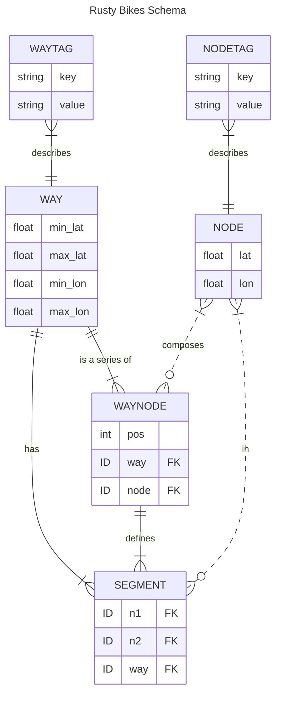

# Rusty Bikes

A project for learning Rust.

Implementing an NYC bike routing site to get a feel for OSM data, pathfinding algs, and serving an API in Rust :crab:

Consists of a Rust server and a simple Leaflet client.

### Requirements
- A JSON OSM export for the area you want to serve (see [OSM Data](#osm-data) for an example query)

### Bootstrapping

The server:
```bash
# init the db
cargo run --bin init-db
cargo run --bin populate-db ./path/to/your/osm/json

# host it at localhost:3000
cargo run --bin rusty_router

# enable request/response tracing
RUST_LOG=tower_http=trace cargo run --bin rusty_router
```

## How it's happening

### OSM Data

The underlying data is coming from [OSM's Overpass API](https://wiki.openstreetmap.org/wiki/Overpass_API). The initial data dump is the result of the OverpassQL query:

```
data=[out:json][timeout:90];
nw(40.647941,-74.028837,40.755695,-73.907988)
  ["highway"]
  [!"footway"]
  ["highway"!="footway"]
  ["highway"!="steps"]
  ["highway"!="street_lamp"]
  ["highway"!="elevator"]
  ["highway"!="bus_stop"]
  ;
out geom;
```

which gives us all relevant [Way](https://wiki.openstreetmap.org/wiki/Way)'s tagged with the [key "highway"](https://wiki.openstreetmap.org/wiki/Key:highway) in roughly Lower Manhattan + over the bridge BK, along with their geometry data (lat-longs + referenced Node lat-longs).

### Primary Alg Considerations

To support an efficient A\* implementation:

- Looking up Node neighbors must be as fast as possible
  - adjacency matrix lookup should be quick
- Costs must be calculated quickly
  - Way tags should be quickly available
    - ie: highway, bicycle, oneway, height, cycleway?, ...
  - _future: add distance calculation to Segments table?_
- We must be able to locate the Way that is closest to our start / end points
  - Enable R\*Tree support on Ways, easily done due to their min/max coords
  - Given a way and a coordinate, where along the Way is this coordinate?

### Schema Design
Those considerations point us to a SQLite schema of:



A primitive first run, with non-duplicated Segments, on `../osm-data/nyc_bk_highways_no_footways.geom.json` results in:
```
26M db.db3

sqlite> select count(*) from Nodes;
98982

sqlite> select count(*) from Ways;
18784

sqlite> select count(*) from WayNodes;
128992

sqlite> select count(*) from Segments;
110208
```

A second run, with duplicated Segments:
```
32M db.db3

sqlite> select count(*) from Segments;
220416
```
So doubling up on Segments results in a 6MB (~25% bigger) DB file. I accept that non-sacrifice in the name of having a simpler Segment query, since I'll need to make that query hundreds of times every route.

A third run, with separate Tags tables:
```
44M db.db3

sqlite> select count(*) from NodeTags;
83197

sqlite> select count(*) from WayTags;
173213
```
Balloons up the file size quite a bit, but potentially worth it to avoid needing to deserialize tags out of a TEXT column every time we calculate Way cost.

### Future things to consider
