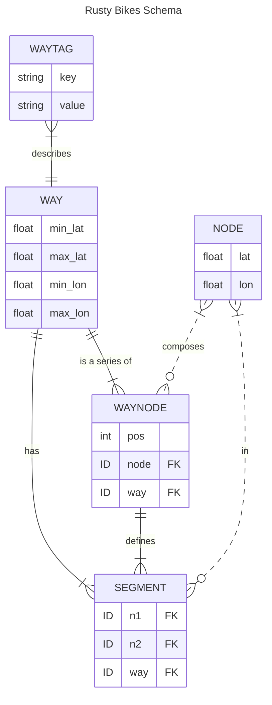

# Rusty Bikes Server

### Requirements
- A JSON OSM export for the area you want to serve (see [OSM Data](#osm-data) for an example query)
- [Cargo Lambda](https://github.com/awslabs/aws-lambda-rust-runtime)

### Bootstrapping

The server:
```bash
# init the db
cargo run --bin init-db
cargo run --bin populate-db ./path/to/your/osm/json

# host it at localhost:9000 using Cargo Lambda
cargo lambda watch

# hit it
curl http://localhost:9000/lambda-url/lambda-handler/traverse?lat=40.68376227690408&lon=-73.96167755126955&depth=20
```

## How it's happening

### OSM Data

The underlying data is coming from [OSM's Overpass API](https://wiki.openstreetmap.org/wiki/Overpass_API). The initial data dump is the result of the OverpassQL query:

```
data=[out:json][timeout:90];
way(40.647941,-74.028837,40.755695,-73.907988)
    ["highway"]
    [!"footway"]
    ["highway"!="footway"]
    ["highway"!="motorway"]
    ["highway"!="motorway_link"]
    ["highway"!="crossing"]
    ["highway"!="steps"]
    ["highway"!="street_lamp"]
    ["highway"!="elevator"]
    ["highway"!="bus_stop"]
    ["bicycle"!="no"]
    ;
out geom;
```

which gives us all relevant [Way](https://wiki.openstreetmap.org/wiki/Way)'s tagged with the [key "highway"](https://wiki.openstreetmap.org/wiki/Key:highway) in roughly Lower Manhattan + over the bridge BK, along with their geometry data (lat-longs + referenced Node lat-longs).

### Primary Alg Considerations

To support an efficient A\* implementation:

- Looking up Node neighbors must be as fast as possible
  - adjacency matrix lookup should be quick
- Costs must be calculated quickly
  - Way tags should be quickly available
    - ie: highway, bicycle, oneway, height, cycleway?, ...
  - _future: pre-add length calculation to Segments table?_
- We must be able to locate the Way that is closest to our start / end points
  - Store Ways in an [R\*Tree](https://sqlite.org/rtree.html) index, easily done due to their min/max coords
  - Given a way and a coordinate, where along the Way is this coordinate?

### Schema Design
Those considerations point us to a SQLite schema of:



### Deployment
Since the SQlite DB is ~15MB zipped and the data access is read-only, currently packaging the DB into the lambda artifact. To reduce deploy times (though marginally) and have a more sacred deploy artifact, I'll probably upload the SQLite DB as a separate Lambda Layer that will get updated on some regular basis, w/ a separate Lambda cron. After that, it's just a simple HTTP API Gateway -> Lambda integration to host this real cheap.

I kinda felt bad about making this choice, because I was a bit excited about getting deep on Tokio concurrency and such, and the AWS Lambda environment brings concurrency to the system-level, but being able to host this simply, for free, outweighed that.
