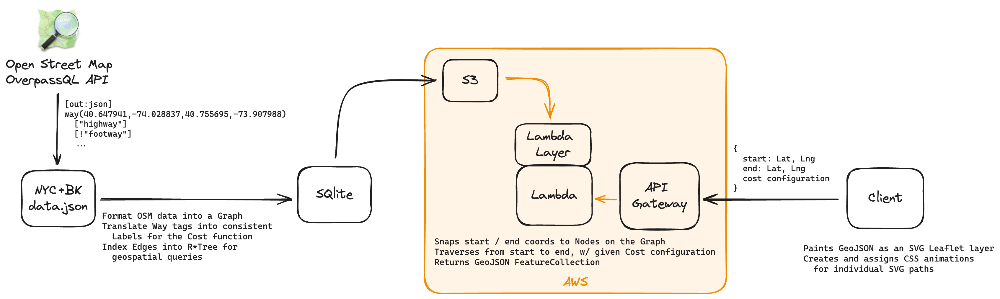
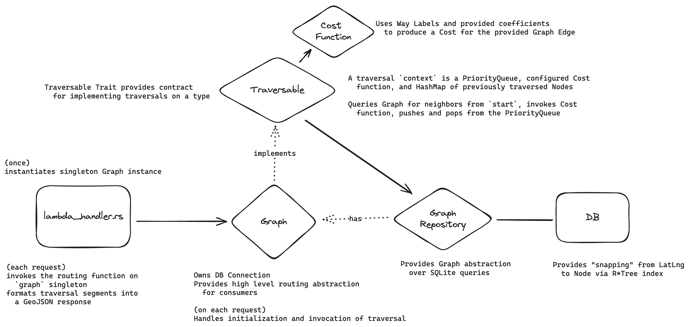
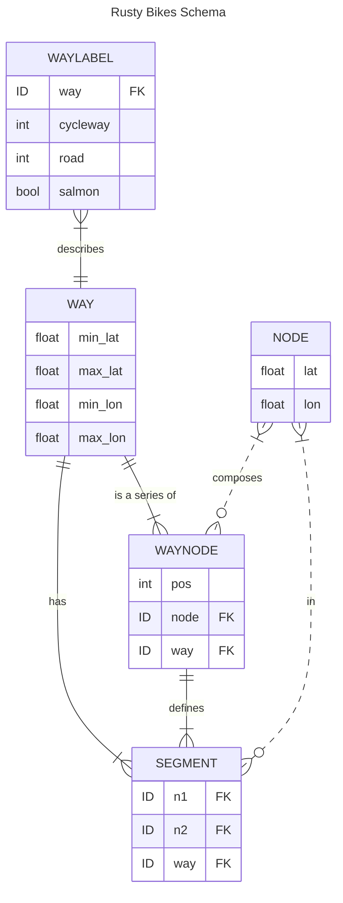

# Rusty Bikes Services

## Bootstrapping

### Requirements

- [Cargo Lambda](https://github.com/awslabs/aws-lambda-rust-runtime)
  - Used to deploy into an AWS Lambda. Also provides a local `watch` environment, which I'm using when running locally to provide hot reloading and keep my dev runtime environment basically identical to the deployed environment.

Do it:

```bash
# (at project root) Use Makefile to fetch OSM data, create the db, and start the project
make service-watch

# hit it
curl http://localhost:9000/lambda-url/lambda-handler/traverse?lat=40.68376227690408&lon=-73.96167755126955&depth=20
```

## How it's happening

1. [Leveraging OSM Data](#leveraging-osm-data)
2. [Data Transformation](#data-transformation)
3. [Labeling Examples](#labeling-examples)
4. [Cost Function](#routing-cost-function)
5. [Query Optimization](#query-optimization)
6. [Hosting](#hosting)

### High Level System


### Rusty Bikes Service


### Leveraging OSM Data

The underlying data is coming from [OSM's Overpass API](https://wiki.openstreetmap.org/wiki/Overpass_API). The initial data dump is from this [OverpassQL query](./scripts/download_osm_data.sh), which gives us all relevant [Way](https://wiki.openstreetmap.org/wiki/Way)'s tagged with the [key "highway"](https://wiki.openstreetmap.org/wiki/Key:highway) in the non-Staten Island NYC boroughs, along with their geometry data (lat-longs + referenced Node lat-longs).

<details>

<summary>Considerations</summary>
The first thought was to use the Overpass API directly while executing pathfinding. Benefits being: I wouldn't have to "own" any data, and could possibly make use of OverpassQL's recursive querying to offload some processing.


This had a few issues:

- Every pathfinding algorithm invokes a "get neighbors" call in the middle of its nested execution loop, thousands of times. Introducing network fetch latency at that level would make pathfinding unusably slow.
- OSM data contains a lot of information that isn't relevant to pathfinding (like building and jurisdiction info). Filtering would take up processing for every request to OSM.

To make the problem more manageable, scope was cut to _just_ bike pathfinding in _just_ NYC. This allowed me to apply a set of filters and a bounding box to the Overpass Query resulting in a ~50MB json file. For comparison, the full planet OSM is [1915 GB uncompressed](https://wiki.openstreetmap.org/wiki/Planet.osm) and the NYC bounding box with ALL Ways (not including bike-relevant filtering) is ~300MB.

Although this does mean owning the data layer for this project, at this scale, we have a lot of flexibility. See [Database Design](#database-design)
</details>

### Data Transformation

Using OSM tags, we can create a consistent data model for understanding the roads in terms of bike-ability. We'll do this _before_ loading the data into our DB, so we can interact with our own data model at runtime rather than the vast OSM tag landscape.

We'll do a lossy translation from that space into 3 dimensions: **Road** type, **Cycleway** type, and **Directionality / Salmoning**.

Because of directionality, we'll save labeling metadata for each **Way** twice, once for the "standard" direction, and once for the "reverse" direction. We'll indicate this by creating 2 Way entries, one with the regular, positive ID, and one with same ID, but _negative_. We can be certain that [no OSM IDs will be negative](https://wiki.openstreetmap.org/wiki/Elements#Common_attributes). The `Road` type will always be the same, but the `Cycleway` and `Salmon` tags may differ.

When assessing the reverse OSM direction, we will check for dedicated infrastructure in this direction, or use the contraflow bike infra, before judging the route as a salmon route.

<details>

<summary>Considerations</summary>

The first naive thought was to dump all the tags into a denormalized table or onto the DB representation of the Ways themselves, and have the pathfinding service make cost function decisions at query-time based on tags.

However, after learning more about how OSM tagging landscape, it was apparent that the rules engine would be large, with many edge cases. See:

- https://wiki.openstreetmap.org/wiki/Bicycle
- https://taginfo.openstreetmap.org/keys/cycleway#values
- https://wiki.openstreetmap.org/wiki/Key:cycleway:right:oneway
- [https://wiki.openstreetmap.org/wiki/Forward*%26_backward,\_left*%26_right](https://wiki.openstreetmap.org/wiki/Forward_%26_backward,_left_%26_right)


Data simplification could happen _before_ pathfinding-time, and, if it was, it made sense to do it as part of an ETL process _before_ the data even made it into the DB itself. This would move this processing out of execution logic and allow us to perform [testing / validation](#labeling-examples) on the resulting dataset.

</details>

#### Road Type

Standardizing the OSM [`highway` tag landscape](https://taginfo.openstreetmap.org/keys/highway#values) into the [North American road hierarchy standards](https://en.wikipedia.org/wiki/Road_hierarchy#United_States_and_Canada) of Local, Collector, and Arterial. Adding Bike and Pedestrian for protected bike paths and pedestrian-centric paths.

See [OverpassQL query](https://overpass-turbo.eu/s/1My7) for these highway designations.

Types:

- **Pedestrian**

  - Rounding [highway=path](https://wiki.openstreetmap.org/wiki/Tag:highway%3Dunclassified) "down" to pedestrian

  ```
  ["highway"="pedestrian"]
  ["highway"="crossing"]
  ["highway"="corridor"]
  ["highway"="footway"]
  ["highway"="path"]
  ["bicycle"="dismount"]
  ```

- **Bike**

  ```
  ["highway"="cycleway"]
  ```

- **Local**

  - [highway=unclassified](https://wiki.openstreetmap.org/wiki/Tag:highway%3Dunclassified)

  ```
  ["highway"="residential"]
  ["highway"="living_street"]
  ["highway"="unclassified"]
  ["highway"="track"]
  ```

- **Collector** (default)

  - absent other designations, we'll default here conservatively

  ```
  ["highway"="secondary"]
  ["highway"="secondary_link"]
  ["highway"="tertiary"]
  ["highway"="tertiary_link"]
  ```

- **Arterial**
  ```
  ["highway"="primary"]
  ["highway"="primary_link"]
  ```

#### Salmon? (Directionality)

You're either going _with_ traffic (**salmon=false**, default) or _against_ traffic (**salmon=true** 🐟). We'll default to the assumption that every path is bidirectional unless there are _explicit_ indicators that the road is a one-way. Then, we will need _explicit_ indicators that bikes can ride bidirectionally.

For the OSM-normal direction:
- **salmon=false** (default)
  - Since the Way is plotted in this direction, I can't really think of any reason why there would be salmoning here.

For OSM-reverse direction:
- **salmon=false** (default)
  ```
  [~"^cycleway:.*:oneway$"="no"] // indicates that the cycleway, despite other indicators, is bidirectional
  ["oneway:bicycle"="no"]       // lesser used in NYC
  ```

- **salmon=true**
  ```
  ["oneway"="yes"]               // indicates that the road is one-way, so, absent other indicators, any bike infra is also oneway
  [~"^cycleway:.*:oneway$"="yes"] // explicitly indicates that the bike infra on this side is oneway
  ["oneway:bicycle"="yes"]       // lesser used in NYC
  ```

#### Cycleway Type

Note: `^cycleway` is referring to the collection of `cycleway:right`, `cycleway:left`, and `cycleway:both`, which all refer to bike infra on the Way.

Because of directionality, `left` and `right` will be important designations. On bidirectional roads, `left`, in the direction the Way has been plotted in OSM, will be the cycleway in the _incoming_ direction while `right` will designate the path along the primary direction. On oneway roads, the `left` or `right` cycleways can be used as primary direction cycleways. When the `cycleway:{direction}:oneway=no` tag is present, this is an explicit indicator that there is bidirectional bike infra, even if the road itself is a oneway for cars.

Types:

- **Track**

  - Indicates a bike path _separate_ from the road
    ```
    ["bicycle"="designated"]
    ["highway"="cycleway"]
    [~"^cycleway"~"track"]
    ```

- **Lane**

  - Indicates a designated bike path _along_ the road
    ```
    [~"^cycleway"~"lane"]
    ```

- **Shared**

  - Explicit indications that bikes are welcome to _share_ the road, generally in the form of a ["sharrow"](https://en.wikipedia.org/wiki/Shared_lane_marking)
    ```
    [~"^cycleway"~"shared_lane"]
    ```

- **No** (default)

  - No bike infra exists here!
    ```
    [~"^cycleway"~"no"]
    ```

### Labeling Examples

One of the joys of this project, and why I wanted to work on it, is that the data is a representation of the built world! Because of this, I was able to think up / find roads around NYC that would act as interesting edge cases for this test suite, and logically assign the labels they should acquire after the ETL process. These first lived as notes, and then were baked into the test suite, which was executed in the ETL development loop, editing the rules engine, processing the OSM JSON, and testing the output SQLite DB.

See [test suite](./tests/way-labeling.rs)

<details>

<summary>Example Test Cases</summary>

#### Ex 1: Bidirectional Road w/ One Bike Lane

[Clermont Ave](https://www.openstreetmap.org/way/654744285#map=16/40.6911/-73.9704&layers=Y) is mapped from North to South, so `right` designations apply to the southbound direction, and `left` designations apply to the northbound direction.

The tags:

```
cycleway:right = lane
highway = residential
```

indicate that it is a local road with a designated bike lane on the road going south, but nothing on the road going north. The lack of the `oneway` tag means it is an implicitly bidirectional road.

In this case, we'll label standard direction Way (654744285) to be `Road.Local`, `Cycleway.Lane`, and the reverse direction Way (-654744285) to be `Cycleway.No`, `Salmon=true`.

#### Ex 2: Bidirectional Road w/ Bike Lanes going both ways
[7th Ave in Park Slope](https://www.openstreetmap.org/way/494221659) is a bidirectional road with bike lanes on both sides, going both ways.

The tags:
```
cycleway:left = lane
cycleway:right = shared_lane
highway = tertiary
oneway = no
```
indicate to us that road going the OSM-normal direction has a `Cycleway.Shared`, while the OSM-reverse direction has a `Cycleway.Lane`. The explicit `oneway=no` tells us that no salmon will be prepared.

#### Ex 3: One Way Road with Bike Lane (on either side)

[Hoyt St](https://www.openstreetmap.org/way/844446016#map=20/40.68871/-73.98636&layers=Y) and [Smith St](https://www.openstreetmap.org/way/420572575#map=20/40.68955/-73.98850&layers=Y) are southbound and northbound streets (respectively) with bike lanes on the left and right sides (also respectively). This case shows that the right side is not necessarily the "forward" direction, just as the left side is not necessarily the "backward" direction.

The tags:
```
cycleway:left = no
cycleway:right = track
cycleway:right:oneway = yes
highway = secondary
oneway = yes
```
and
```
cycleway:left = lane
cycleway:left:oneway = yes
cycleway:right = no
highway = residential
oneway = yes
```
indicate that they are each one-way roads with bike lanes that are one-way themselves, going along with traffic.

In this case, we'll label the standard direction Ways (844446016, 420572575) appropriately, and the reverse direction Ways with `Salmon=true`.

#### Ex 4: Bidirectional Bike Lane
[Chrystie St](https://www.openstreetmap.org/way/464964299) is mapped South to North, so `right` designations apply to the northbound direction.

The tags:
```
cycleway:left = no
cycleway:right = track
cycleway:right:oneway = no
highway = secondary
oneway = no
```
indicate that it is a bidirectional collector road with designated, bidirectional bike infra on the right side of the road.

We'll label the standard direction Way (464964299) to be `Road.Collector`, `Cycleway.Track`. Since there is no left-side bike infra and the right side is one-way, the salmoning biker would use the right-side Track, or: (-464964299) => `Cycleway.Track`, `Salmon=false`.

#### Ex 5: Edge Case! One Way Road and a Contraflow Bike Lane
[Bond St bw Schermerhorn and Livingston](https://www.openstreetmap.org/way/455014439) is mapped South to North, so `right` designations apply to the northbound direction.

The tags:
```
cycleway:right = track
cycleway:right:oneway = -1
highway = residential
oneway = yes
oneway:bicycle = no
```
indicate that it is a one-way local road going northbound, but with a designated bike lane going south, on the right side.

We'll label the standard direction Way (455014439) to be `Road.Local`, `Cycleway.No`, `Salmon=false`. The reverse (-455014439) will be labeled `Cycleway.Track`, `Salmon=false`.

</details>

### Routing Cost Function

This piece of the system should use the bike path labels to return high "costs" for undesireable biking paths (like busy streets with no dedicated bike lanes (ie: [Atlantic Ave](https://www.openstreetmap.org/way/1204342261)), and low "costs" for desireable biking paths (like [along Flushing Ave / BK Naval Yards](https://www.openstreetmap.org/way/488161824)).

<details>

<summary>Considerations</summary>
I didn't have much prior art to reference for this problem. At a high level, it made sense to me to have:

- Percentage based contribution
   - Road type account for some percentage of the cost, the Cycleway type for another percentage, and Salmoning for another.
- Model Weights
   - Each Road and Cycleway type would have some inherent weight to them, to numerically differentiate bike lanes from shared lanes.
   - These could be defined at API invocation time by a client, to customize the pathfinding alg
- Cost Factor vs "True" Cost
   - It also made intuitive sense that this cost "factor" would be applied against the length of the Way (so short roads with high cost may be preferable to long, winding, low cost paths) to obtain the "true" cost of choosing this path

I started simple with a function like:
```
Road.Bike = 0.5
Road.Pedestrian = 1.2
Road.Secondary = 1.5
... (or user-defined)

Cycleway.Track = 0.5
Cycleway.Lane = 1.0
Cycleway.Shared = 1.5
... (or user-defined)

cost_factor = (road_type * 30%) + (cycleway_type * 40%) + (30% if salmoning)

true_cost = cost_factor * way_length
```

which worked (to me) surprisingly well.

The next big insight was that salmoning was having a flat, consistent impact on the cost, with no regard to the Road / Cycleway types. This didn't make sense. Salmoning on a major road like Atlantic Ave is different than salmoning on a side residential street. So the contribution percentages were adjusted and salmoning was modified to be a configurable percentage multiplier of the rest of the cost:

```
salmon_multiplier = 30% (or user-defined)

cost_factor = (road_type * 50%) + (cycleway_type * 50%)
cost_factor *= (salmon_multiplier if salmoning)

true_cost = cost_factor * way_length
```

This worked more naturally, and pathfinding began suggesting salmoning at more reasonable locations.

</details>

### Query Optimization

To support an efficient A\* implementation:

- Looking up Node neighbors must be as fast as possible
- Costs must be calculated quickly
  - Labels should be quickly available for each Way
- We must be able to locate the Nodes that are closest to our start / end points
  - Geospatial querying of dataset

### Database Design

<details>
<summary>Considerations</summary>

Where to put this data. How to query it. Generally, I saw the following options: SQLite, DynamoDB / a NoSQL DB, or Amazon Neptune / Neo4j.


Given the considerations below, decided that the enabled iteration speed, free-ness of deployment, and extremely low barrier to entry provided by SQLite made it my first choice for kicking off this project. The cons of the choice were essentially mitigated by it not needing cross-network calls or separate DB mgmt to be added to the project.


When expanding to support multiple cities, I'd be interested in exploring how a Graph DB compares in speed of execution / ergonomics of working w/ the data.

#### SQLite
Pros:
- This data is like 50MB, easily served by this tech
- Easy to get started
- No extra infra => speed of querying on disk + FREE
- Access patterns are simple / defined / easily indexable
- Geospatial querying (!!) w/ [R*Tree module](https://sqlite.org/rtree.html)

Cons:
- Would need to normalize Labels away from Ways away from Nodes, requiring JOINs for many queries

#### DynamoDB / a NoSQL DB
Pros:
- A normalized Node document makes intuitive sense
  - It would include its neighbor Node IDs, the Labels + IDs for the Ways connecting them
  - One DB call, no joins, in the middle of the pathfinding execution loop
- [Geohashing](https://aws.amazon.com/blogs/compute/implementing-geohashing-at-scale-in-serverless-web-applications/) is a generally supported strategy
- W/ DDB, [DAX](https://docs.aws.amazon.com/amazondynamodb/latest/developerguide/DAX.html) could likely be used to offload subsequent queries into the cache (assuming most of our use case is people playing around w/ different pathfinding configurations on the same route)

Cons:
- W/ DDB, price / performance / provisioning tradeoffs would be important
- DAX, though useful for our use case, is not "serverless", and charges by the instance-hour
- If not DDB, would need to deploy / manage a DB

#### Neo4j
Pros:
- A graph db for graph traversals!
  - Promises of extremely efficient relational queries / pathfinding
- Never used it before; would be a great learning opportunity

Cons:
- No officially supported Rust driver (but a [community-written one](https://github.com/neo4j-labs/neo4rs) published recently)
- Wanted to write A* myself in Rust -- but would likely want to take advantage of any Graph DB optimizations
- If not Neptune, would need to deploy / manage a DB

</details>

Those considerations point us to a SQLite schema of:



### Hosting

Since the SQlite DB is ~20MB zipped and the data access is read-only, currently uploading the DB as a Lambda Layer. The Rust code is packaged by SAM Toolkit into an AWS Lambda Runtime, and configured to access SQLite in the attached Lambda Layer. After that, it's just a simple HTTP API Gateway -> Lambda integration to host this real ~cheap~ free.

I kinda felt bad about making this choice, because I was a bit excited about getting deep on Tokio concurrency and such, and the AWS Lambda environment brings API concurrency to the system-level, but being able to host this simply, for free, outweighed that. There are still opportunities to explore concurrency during pathfinding, but that may be somewhat limited due to SQLite's concurrency model.
