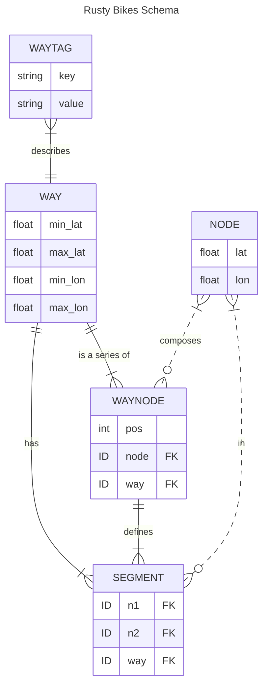

# Rusty Bikes Services

## Bootstrapping

### Requirements

- A JSON OSM export for the area you want to serve (see [OSM Data](#osm-data) for an example query)
- [Cargo Lambda](https://github.com/awslabs/aws-lambda-rust-runtime)

Do it:

```bash
# (at project root) Use Makefile to fetch OSM data, create the db, and start the project
make service-watch

# hit it
curl http://localhost:9000/lambda-url/lambda-handler/traverse?lat=40.68376227690408&lon=-73.96167755126955&depth=20
```

## How it's happening

1. [Leveraging OSM Data](#leveraging-osm-data)
2. [Labeling Definitions](#labeling-definitions)
3. [Labeling Examples](#labeling-examples)
4. [Cost Model](#routing-cost-model)
5. [Query Optimization](#query-optimization)
6. [Hosting](#hosting)

### Leveraging OSM Data

The underlying data is coming from [OSM's Overpass API](https://wiki.openstreetmap.org/wiki/Overpass_API). The initial data dump is the result of the OverpassQL query:

```
data=[out:json][timeout:90];
way(40.647941,-74.028837,40.755695,-73.907988)
    ["highway"]
    [!"footway"]
    ["highway"!="footway"]
    ["highway"!="motorway"]
    ["highway"!="motorway_link"]
    ["highway"!="trunk"]
    ["highway"!="trunk_link"]
    ["highway"!="construction"]
    ["highway"!="steps"]
    ["highway"!="street_lamp"]
    ["highway"!="elevator"]
    ["highway"!="bus_stop"]
    ["highway"!="platform"]
    ["bicycle"!="no"]
    ;
out geom;
```

which gives us all relevant [Way](https://wiki.openstreetmap.org/wiki/Way)'s tagged with the [key "highway"](https://wiki.openstreetmap.org/wiki/Key:highway) in roughly Lower Manhattan + over the bridge BK, along with their geometry data (lat-longs + referenced Node lat-longs).

### Labeling Definitions

Using OSM tags, we can create a consistent data model for understanding the roads in terms of bike-ability. We'll do this _before_ loading the data into our DB, so we can interact with our own data model at runtime rather than the sometimes-inconsistent OSM tag landscape.

Because of directionality, `left` and `right` will be important designations. `left`, in the direction of the Way, will be the _opposite_ direction. `right` will designate the path along the primary direction.

See:

- https://wiki.openstreetmap.org/wiki/Bicycle
- https://taginfo.openstreetmap.org/keys/cycleway#values
- https://taginfo.openstreetmap.org/keys/bicycle#values
- [https://wiki.openstreetmap.org/wiki/Forward*%26_backward,\_left*%26_right](https://wiki.openstreetmap.org/wiki/Forward_%26_backward,_left_%26_right)

#### Cycleway Type

Types:

- **Track**

  - Indicates a bike path _separate_ from the road
    ```
    ["bicycle"="designated"]
    ["highway"="cycleway"]
    [~"^cycleway"~"track"]
    ```

- **Lane**

  - Indicates a designated bike path _along_ the road
    ```
    ["bicycle"="yes"]
    [~"^cycleway"~"lane"]
    ```

- **Shared** (default)

  - Explicit indications that bikes are welcome to _share_ the road
  - Given no other indications, this will be the default assumption, since bikes can kinda go anywhere
  - Cost will then depend on how this combines with the Road type and the Directionality
    ```
    [~"^cycleway"~"shared_lane"]
    [~"^cycleway"~"no"]
    ```

#### Directionality

You're either going _with_ traffic (**None**, default) or _against_ traffic (**salmoning** 🐟). We'll default to the assumption that every path is bidirectional unless there are _explicit_ indicators that the road is a one-way. Then, we will need _explicit_ indicators that bikes can ride bidirectionally.

Types:

- **None** (default)

  - No explicit indication that the road is a one-way.
  - OR, it is a one-way road, but the bike path is NOT.

    ```
    [~"^cycleway.*:oneway$"="no"]
    ["oneway"="no"]
    ```

- **Salmon**
  - Explicit indication that the road is a one-way.
  - No explicit indication that the bike path is exempt from that.
    ```
    [~"^cycleway.*:oneway$"="yes"]
    ["oneway"="yes"]
    ```

#### Road Type

Standardizing the OSM [`highway` tag landscape](https://taginfo.openstreetmap.org/keys/highway#values) into the [North American road hierarchy standards](https://en.wikipedia.org/wiki/Road_hierarchy#United_States_and_Canada) of Local, Collector, and Arterial. Adding Bike and Pedestrian for protected bike paths and pedestrian-centric paths.

See [OverpassQL query](https://overpass-turbo.eu/s/1My7) for these highway designations.

Types:

- **Pedestrian**

  - Rounding [highway=path](https://wiki.openstreetmap.org/wiki/Tag:highway%3Dunclassified) "down" to pedestrian

  ```
  ["highway"="pedestrian"]
  ["highway"="crossing"]
  ["highway"="corridor"]
  ["highway"="footway"]
  ["highway"="path"]
  ["bicycle"="dismount"]
  ```

- **Bike**

  ```
  ["highway"="cycleway"]
  ```

- **Local**

  - See: [highway=unclassified](https://wiki.openstreetmap.org/wiki/Tag:highway%3Dunclassified)

  ```
  ["highway"="residential"]
  ["highway"="living_street"]
  ["highway"="unclassified"]
  ["highway"="track"]
  ```

- **Collector** (default)

  - absent other designations, we'll default here conservatively

  ```
  ["highway"="secondary"]
  ["highway"="secondary_link"]
  ["highway"="tertiary"]
  ["highway"="tertiary_link"]
  ```

- **Arterial**
  ```
  ["highway"="primary"]
  ["highway"="primary_link"]
  ```

### Labeling Examples

Because of directionality, we'll save labeling metadata for each **Way** twice, once for the "standard" direction, and once for the "reverse" direction. We'll indicate this by creating 2 Way entries, one with the regular, positive ID, and one with a _negative_ id. We can be certain that [no OSM IDs will be negative](https://wiki.openstreetmap.org/wiki/Elements#Common_attributes).

#### Ex 1: Bidirectional Road w/ Asymmetric Bike Lanes

[Clermont Ave](https://www.openstreetmap.org/way/654744285#map=16/40.6911/-73.9704&layers=Y) is mapped from North to South, so `right` designations apply to the southbound direction, and `left` designations apply to the northbound direction.

The tags:

```
cycleway:right = lane
highway = residential
```

indicate that it is a residential road with a designated bike lane on the road going south, but nothing on the road going north.

In this case, we'll label standard direction Way (654744285) to be `Road.Local`, `Cycleway.Lane`, and the reverse direction Way (-654744285) to be `Road.Local`, `Cycleway.Shared`, `Salmon=false`.

#### Ex 2: One Way Road with Bike Lane

[Dekalb Ave](https://www.openstreetmap.org/way/903142088#map=17/40.68972/-73.97563&layers=Y) is mapped East to West, so `right` designations apply to the eastbound direction and `left` designations apply to the westbound direction.

The tags:

```
bicycle = yes
cycleway:left = lane
cycleway:left:lane = exclusive
cycleway:left:oneway = yes
cycleway:right = no
oneway = yes
oneway:bicycle = yes
highway = secondary
```

indicate that it is a one way, major road with a designated bike lane going west, but with no bike infrastructure going against traffic.

In this case, we'll label the standard direction Way (903142088) to be `Road.Collector`, `Cycleway.Lane`, and the reverse direction Way (-903142088) with `Road.Collector`, `Cycleway.Shared`, `Salmon=true`.

### Routing Cost Model

This piece of the system should use the bike path labels to return high "costs" for undesireable biking paths (like busy streets with no dedicated bike lanes (ie: [Atlantic Ave](https://www.openstreetmap.org/way/1204342261)), and low "costs" for desireable biking paths (like [along Flushing Ave / BK Naval Yards](https://www.openstreetmap.org/way/488161824)).

Considerations:

- What is high cost vs low cost? Grade things on a 0 -> 100 scale?

### Query Optimization

To support an efficient A\* implementation:

- Looking up Node neighbors must be as fast as possible
  - adjacency matrix lookup should be quick
- Costs must be calculated quickly
  - Labels should be quickly available for each Way
- We must be able to locate the Way that is closest to our start / end points
  - Store Ways in an [R\*Tree](https://sqlite.org/rtree.html) index, easily done due to their min/max coords
  - Given a way and a coordinate, where along the Way is this coordinate?

### Schema Design

Those considerations point us to a SQLite schema of:



### Hosting

Since the SQlite DB is ~15MB zipped and the data access is read-only, currently packaging the DB into the lambda artifact. To reduce deploy times (though marginally) and have a more sacred deploy artifact, I'll probably upload the SQLite DB as a separate Lambda Layer that will get updated on some regular basis, w/ a separate Lambda cron. After that, it's just a simple HTTP API Gateway -> Lambda integration to host this real cheap.

I kinda felt bad about making this choice, because I was a bit excited about getting deep on Tokio concurrency and such, and the AWS Lambda environment brings concurrency to the system-level, but being able to host this simply, for free, outweighed that.
