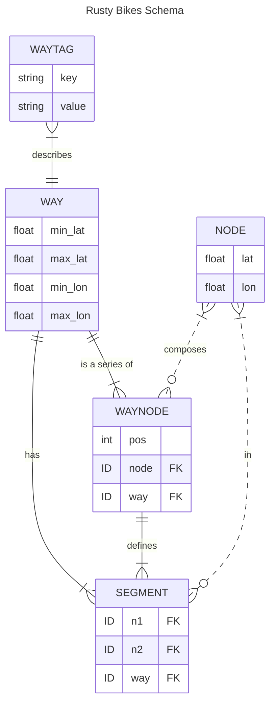

# Rusty Bikes Server

### Requirements

- A JSON OSM export for the area you want to serve (see [OSM Data](#osm-data) for an example query)
- [Cargo Lambda](https://github.com/awslabs/aws-lambda-rust-runtime)

### Bootstrapping

The server:

```bash
# init the db
cargo run --bin init-db
cargo run --bin populate-db ./path/to/your/osm/json

# host it at localhost:9000 using Cargo Lambda
cargo lambda watch

# hit it
curl http://localhost:9000/lambda-url/lambda-handler/traverse?lat=40.68376227690408&lon=-73.96167755126955&depth=20
```

## How it's happening

<details>
<summary>Leveraging OSM Data</summary>

The underlying data is coming from [OSM's Overpass API](https://wiki.openstreetmap.org/wiki/Overpass_API). The initial data dump is the result of the OverpassQL query:

```
data=[out:json][timeout:90];
way(40.647941,-74.028837,40.755695,-73.907988)
    ["highway"]
    [!"footway"]
    ["highway"!="footway"]
    ["highway"!="motorway"]
    ["highway"!="motorway_link"]
    ["highway"!="steps"]
    ["highway"!="street_lamp"]
    ["highway"!="elevator"]
    ["highway"!="bus_stop"]
    ["bicycle"!="no"]
    ;
out geom;
```

which gives us all relevant [Way](https://wiki.openstreetmap.org/wiki/Way)'s tagged with the [key "highway"](https://wiki.openstreetmap.org/wiki/Key:highway) in roughly Lower Manhattan + over the bridge BK, along with their geometry data (lat-longs + referenced Node lat-longs).

</details>

<details>
<summary>Bike Lane Labeling</summary>

Using OSM tags, we can create a consistent data model for understanding the roads in terms of bike-ability. We'll do this _before_ loading the data into our DB, so we can interact with our own data model at runtime rather than the sometimes-inconsistent OSM tag landscape.

See:

- https://wiki.openstreetmap.org/wiki/Bicycle
- https://taginfo.openstreetmap.org/keys/cycleway#values
- https://taginfo.openstreetmap.org/keys/bicycle#values

### Bike Paths

Types:

- **Track**

  - Indicates a bike path _separate_ from the road
    ```
    way["bicycle"="designated"];
    way["highway"="cycleway"];
    way[~"^cycleway"~"track"];
    ```

- **Lane**

  - Indicates a designated bike path _along_ the road
    ```
    way["bicycle"="yes"];
    way[~"^cycleway"~"lane"];
    ```

- **Shared** (default)

  - Explicit indications that bikes are welcome to _share_ the road
    ```
    way[~"^cycleway"~"shared_lane"];
    ```

- **Pedestrian**

  - Not yet implemented
  - Indicates that this area is a pedestrian walking area
  - ex: [Myrtle Avenue near Brooklyn Commons](https://www.openstreetmap.org/way/5679971)

    ```
    way["bicycle"="dismount"];
    way["highway"="pedestrian"];
    way["highway"="footway"];
    ```

- **None**

  - No explicit indications for bike lanes / sharrows
  - BUT: the initial query filters out roads with _explicit_ indicators that bikes _cannot_ ride
  - So this will likely be graded against the type of **Road** it's on

### Directionality

See:

- [https://wiki.openstreetmap.org/wiki/Forward*%26_backward,\_left*%26_right](https://wiki.openstreetmap.org/wiki/Forward_%26_backward,_left_%26_right)

Types:

- **Bike Oneway**
- **Bike Bidirectional**
  - means we can ignore oneway road designations
  ```
  [~"^cycleway.*:oneway$"="no"];
  ```
- **Road Oneway**
  - more dangerous to bike against traffic

### Road Type

See:

- https://taginfo.openstreetmap.org/keys/highway#values

Types:

- **Residential**

  ```
  ["highway"="residential"];
  ```

  </details>

<details>
<summary>Routing Cost Model</summary>

This piece of the system should use the bike path labels to return high "costs" for undesireable biking paths (like busy streets with no dedicated bike lanes (ie: [Atlantic Ave](https://www.openstreetmap.org/way/1204342261)), and low "costs" for desireable biking paths (like [along Flushing Ave / BK Naval Yards](https://www.openstreetmap.org/way/488161824)).

Considerations:

- What is high cost vs low cost? Grade things on a 0 -> 100 scale?
</details>

<details>
<summary>Query Optimization</summary>

TODO: update this after doing labeling during ETL

To support an efficient A\* implementation:

- Looking up Node neighbors must be as fast as possible
  - adjacency matrix lookup should be quick
- Costs must be calculated quickly
  - Way tags should be quickly available
    - ie: highway, bicycle, oneway, height, cycleway?, ...
  - _future: pre-add length calculation to Segments table?_
- We must be able to locate the Way that is closest to our start / end points
  - Store Ways in an [R\*Tree](https://sqlite.org/rtree.html) index, easily done due to their min/max coords
  - Given a way and a coordinate, where along the Way is this coordinate?
  </details>

<details>
<summary>Schema Design</summary>

Those considerations point us to a SQLite schema of:



</details>

<details>
<summary>Hosting</summary>

Since the SQlite DB is ~15MB zipped and the data access is read-only, currently packaging the DB into the lambda artifact. To reduce deploy times (though marginally) and have a more sacred deploy artifact, I'll probably upload the SQLite DB as a separate Lambda Layer that will get updated on some regular basis, w/ a separate Lambda cron. After that, it's just a simple HTTP API Gateway -> Lambda integration to host this real cheap.

I kinda felt bad about making this choice, because I was a bit excited about getting deep on Tokio concurrency and such, and the AWS Lambda environment brings concurrency to the system-level, but being able to host this simply, for free, outweighed that.

</details>
