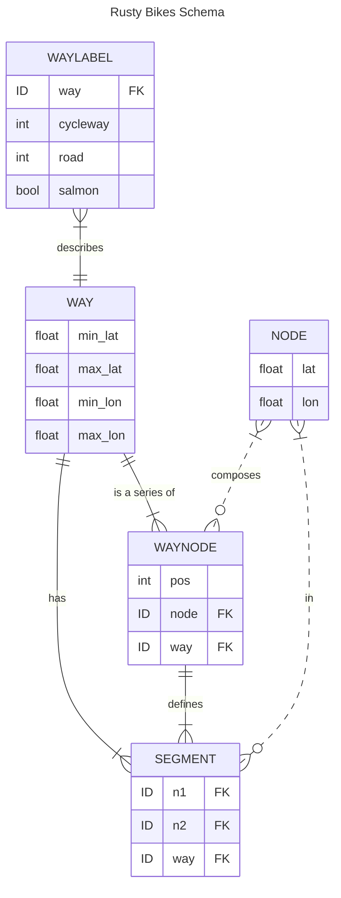

# Rusty Bikes Services

## Bootstrapping

### Requirements

- A JSON OSM export for the area you want to serve (see [OSM Data](#osm-data) for an example query)
- [Cargo Lambda](https://github.com/awslabs/aws-lambda-rust-runtime)

Do it:

```bash
# (at project root) Use Makefile to fetch OSM data, create the db, and start the project
make service-watch

# hit it
curl http://localhost:9000/lambda-url/lambda-handler/traverse?lat=40.68376227690408&lon=-73.96167755126955&depth=20
```

## How it's happening

1. [Leveraging OSM Data](#leveraging-osm-data)
2. [Labeling Definitions](#labeling-definitions)
3. [Labeling Examples](#labeling-examples)
4. [Cost Model](#routing-cost-model)
5. [Query Optimization](#query-optimization)
6. [Hosting](#hosting)

### Leveraging OSM Data

The underlying data is coming from [OSM's Overpass API](https://wiki.openstreetmap.org/wiki/Overpass_API). The initial data dump is the result of the [OverpassQL query](./scripts/download_osm_data.sh), which gives us all relevant [Way](https://wiki.openstreetmap.org/wiki/Way)'s tagged with the [key "highway"](https://wiki.openstreetmap.org/wiki/Key:highway) in roughly Lower Manhattan + over the bridge BK, along with their geometry data (lat-longs + referenced Node lat-longs).

### Labeling Definitions

Using OSM tags, we can create a consistent data model for understanding the roads in terms of bike-ability. We'll do this _before_ loading the data into our DB, so we can interact with our own data model at runtime rather than the sometimes-inconsistent OSM tag landscape.

We'll do a lossy translation from that space into our 3 dimensions: Road type, Cycleway type, and Directionality.

See:

- https://wiki.openstreetmap.org/wiki/Bicycle
- https://taginfo.openstreetmap.org/keys/cycleway#values
- https://wiki.openstreetmap.org/wiki/Key:cycleway:right:oneway
- [https://wiki.openstreetmap.org/wiki/Forward*%26_backward,\_left*%26_right](https://wiki.openstreetmap.org/wiki/Forward_%26_backward,_left_%26_right)

#### Road Type

Standardizing the OSM [`highway` tag landscape](https://taginfo.openstreetmap.org/keys/highway#values) into the [North American road hierarchy standards](https://en.wikipedia.org/wiki/Road_hierarchy#United_States_and_Canada) of Local, Collector, and Arterial. Adding Bike and Pedestrian for protected bike paths and pedestrian-centric paths.

See [OverpassQL query](https://overpass-turbo.eu/s/1My7) for these highway designations.

Types:

- **Pedestrian**

  - Rounding [highway=path](https://wiki.openstreetmap.org/wiki/Tag:highway%3Dunclassified) "down" to pedestrian

  ```
  ["highway"="pedestrian"]
  ["highway"="crossing"]
  ["highway"="corridor"]
  ["highway"="footway"]
  ["highway"="path"]
  ["bicycle"="dismount"]
  ```

- **Bike**

  ```
  ["highway"="cycleway"]
  ```

- **Local**

  - See: [highway=unclassified](https://wiki.openstreetmap.org/wiki/Tag:highway%3Dunclassified)

  ```
  ["highway"="residential"]
  ["highway"="living_street"]
  ["highway"="unclassified"]
  ["highway"="track"]
  ```

- **Collector** (default)

  - absent other designations, we'll default here conservatively

  ```
  ["highway"="secondary"]
  ["highway"="secondary_link"]
  ["highway"="tertiary"]
  ["highway"="tertiary_link"]
  ```

- **Arterial**
  ```
  ["highway"="primary"]
  ["highway"="primary_link"]
  ```

#### Salmon? (Directionality)

You're either going _with_ traffic (**salmon=false**, default) or _against_ traffic (**salmon=true** 🐟). We'll default to the assumption that every path is bidirectional unless there are _explicit_ indicators that the road is a one-way. Then, we will need _explicit_ indicators that bikes can ride bidirectionally.

For the OSM-normal direction:
- **salmon=false** (default)
  - Since the Way is plotted in this direction, I can't really think of any reason why there would be salmoning here.

For OSM-reverse direction:
- **salmon=false** (default)
  ```
  [~"^cycleway:.*:oneway$"="no"] // indicates that the cycleway, despite other indicators, is bidirectional
  ["oneway:bicycle"="no"]       // lesser used in NYC
  ```

- **salmon=true**
  ```
  ["oneway"="yes"]               // indicates that the road is one-way, so, absent other indicators, any bike infra is also oneway
  [~"^cycleway:.*:oneway$"="yes"] // explicitly indicates that the bike infra on this side is oneway
  ["oneway:bicycle"="yes"]       // lesser used in NYC
  ```

#### Cycleway Type

Note: `^cycleway` is referring to the collection of `cycleway:right`, `cycleway:left`, and `cycleway:both`, which all refer to bike infra on the Way.

Because of directionality, `left` and `right` will be important designations. On bidirectional roads, `left`, in the direction the Way has been plotted in OSM, will be the cycleway in the _incoming_ direction while `right` will designate the path along the primary direction. On oneway roads, the `left` or `right` cycleways can be used as primary direction cycleways. When the `cycleway:{direction}:oneway=no` tag is present, this is an explicit indicator that there is bidirectional bike infra, even if the road itself is a oneway for cars. 

Types:

- **Track**

  - Indicates a bike path _separate_ from the road
    ```
    ["bicycle"="designated"]
    ["highway"="cycleway"]
    [~"^cycleway"~"track"]
    ```

- **Lane**

  - Indicates a designated bike path _along_ the road
    ```
    [~"^cycleway"~"lane"]
    ```

- **Shared** (default)

  - Explicit indications that bikes are welcome to _share_ the road
  - Given no other indications, this will be the default assumption, since bikes could theoretically salmon up roads / bike lanes
  - Cost will then depend on how this combines with the Road type and the Directionality
    ```
    [~"^cycleway"~"shared_lane"]
    [~"^cycleway"~"no"]
    ```

### Labeling Examples

Because of directionality, we'll save labeling metadata for each **Way** twice, once for the "standard" direction, and once for the "reverse" direction. We'll indicate this by creating 2 Way entries, one with the regular, positive ID, and one with a _negative_ id. We can be certain that [no OSM IDs will be negative](https://wiki.openstreetmap.org/wiki/Elements#Common_attributes). The `Road` type will always be the same, but the `Cycleway` and `Salmon` tags may differ.

Bikers going the opposite direction will check first for dedicated infrastructure in their direction, or use the contraflow bike infra.

See [test suite](./tests/way_labeling.rs)

#### Ex 1: Bidirectional Road w/ One Bike Lane

[Clermont Ave](https://www.openstreetmap.org/way/654744285#map=16/40.6911/-73.9704&layers=Y) is mapped from North to South, so `right` designations apply to the southbound direction, and `left` designations apply to the northbound direction.

The tags:

```
cycleway:right = lane
highway = residential
```

indicate that it is a local road with a designated bike lane on the road going south, but nothing on the road going north. The lack of the `oneway` tag means it is an implicitly bidirectional road.

In this case, we'll label standard direction Way (654744285) to be `Road.Local`, `Cycleway.Lane`, and the reverse direction Way (-654744285) to be `Cycleway.Lane`, `Salmon=true`.

#### Ex 2: Bidirectional Road w/ Bike Lanes going both ways
[7th Ave in Park Slope](https://www.openstreetmap.org/way/494221659) is a bidirectional road with bike lanes on both sides, going both ways. 

The tags:
```
cycleway:left = lane
cycleway:right = shared_lane
highway = tertiary
oneway = no
```
indicate to us that road going the OSM-normal direction has a `Cycleway.Shared`, while the OSM-reverse direction has a `Cycleway.Lane`. The explicit `oneway=no` tells us that no salmon will be prepared.

#### Ex 3: One Way Road with Bike Lane (on either side)

[Hoyt St](https://www.openstreetmap.org/way/844446016#map=20/40.68871/-73.98636&layers=Y) and [Smith St](https://www.openstreetmap.org/way/420572575#map=20/40.68955/-73.98850&layers=Y) are southbound and northbound streets (respectively) with bike lanes on the left and right sides (also respectively). This case shows that the right side is not necessarily the "forward" direction, just as the left side is not necessarily the "backward" direction.

The tags:
```
cycleway:left = no
cycleway:right = track
cycleway:right:oneway = yes
highway = secondary
oneway = yes
```
and
```
cycleway:left = lane
cycleway:left:oneway = yes
cycleway:right = no
highway = residential
oneway = yes
```
indicate that they are each one-way roads with bike lanes that are one-way themselves, going along with traffic.

In this case, we'll label the standard direction Ways (844446016, 420572575) appropriately, and the reverse direction Ways with `Salmon=true`.

#### Ex 4: Bidirectional Bike Lane
[Chrystie St](https://www.openstreetmap.org/way/464964299) is mapped South to North, so `right` designations apply to the northbound direction.

The tags:
```
cycleway:left = no
cycleway:right = track
cycleway:right:oneway = no
highway = secondary
oneway = no
```
indicate that it is a bidirectional collector road with designated, bidirectional bike infra on the right side of the road.

We'll label the standard direction Way (464964299) to be `Road.Collector`, `Cycleway.Track`. Since there is no left-side bike infra and the right side is one-way, the salmoning biker would use the right-side Track, or: (-464964299) => `Cycleway.Track`, `Salmon=false`.

#### Ex 5: Edge Case! One Way Road and a Contraflow Bike Lane
[Bond St bw Schermerhorn and Livingston](https://www.openstreetmap.org/way/455014439) is mapped South to North, so `right` designations apply to the northbound direction.

The tags:
```
cycleway:right = track
cycleway:right:oneway = -1
highway = residential
oneway = yes
oneway:bicycle = no
```
indicate that it is a one-way local road going northbound, but with a designated bike lane going south, on the right side. 

We'll label the standard direction Way (455014439) to be `Road.Local`, `Cycleway.Shared` (due to lack of bike infra in their direction, a biker would use the road), `Salmon=false`. The reverse (-455014439) will be labeled `Cycleway.Track`, `Salmon=false`.

### Routing Cost Model

This piece of the system should use the bike path labels to return high "costs" for undesireable biking paths (like busy streets with no dedicated bike lanes (ie: [Atlantic Ave](https://www.openstreetmap.org/way/1204342261)), and low "costs" for desireable biking paths (like [along Flushing Ave / BK Naval Yards](https://www.openstreetmap.org/way/488161824)).

Considerations:

- What is high cost vs low cost? Grade things on a 0 -> 100 scale?

### Query Optimization

To support an efficient A\* implementation:

- Looking up Node neighbors must be as fast as possible
  - adjacency matrix lookup should be quick
- Costs must be calculated quickly
  - Labels should be quickly available for each Way
- We must be able to locate the Way that is closest to our start / end points
  - Store Ways in an [R\*Tree](https://sqlite.org/rtree.html) index, easily done due to their min/max coords
  - Given a way and a coordinate, where along the Way is this coordinate?

### Schema Design

Those considerations point us to a SQLite schema of:



### Hosting

Since the SQlite DB is ~15MB zipped and the data access is read-only, currently packaging the DB into the lambda artifact. To reduce deploy times (though marginally) and have a more sacred deploy artifact, I'll probably upload the SQLite DB as a separate Lambda Layer that will get updated on some regular basis, w/ a separate Lambda cron. After that, it's just a simple HTTP API Gateway -> Lambda integration to host this real cheap.

I kinda felt bad about making this choice, because I was a bit excited about getting deep on Tokio concurrency and such, and the AWS Lambda environment brings concurrency to the system-level, but being able to host this simply, for free, outweighed that.
